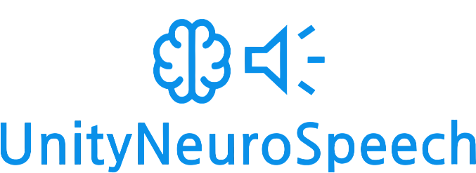

 

  

#

> **Make your Unity characters hear, think, and talk — using real voice AI. Locally. No cloud.**

---

> [!IMPORTANT]
> Full response time (from your speech to TTS generated voice) can sometimes take a minute or more right now.
> This isn't a bug – it's the current reality of running powerful AI models locally and for free:
> - Good STT (like Whisper) needs time to be accurate.
> - Even small LLM (via Ollama) needs some time to think up a good response.
> - Generating high-quality voice with TTS is also a complex and not fast task.
> 
> The key thing is: this framework is built on the most optimal and user-friendly local solutions available for each stage (STT, LLM, TTS). You have the freedom to choose and download your own models (like Whisper `.bin` for STT and any model for Ollama), to use any custom voice you want, to make it for different languages, to customize your agents and to find the perfect balance between speed and quality for your setup.
> 
> Also this project is actively maintained. With every update, I'm working on making it faster, more optimized, and easier to use!

---

UnityNeuroSpeech is a lightweight and open-source framework for creating **fully voice-interactive AI agents** inside Unity.  
It connects:

- 🧠 **Whisper** (STT) – converts your speech into text  
- 💬 **Ollama** (LLM) – generates smart responses  
- 🗣️ **XTTS** (TTS) – speaks back with *custom voice + emotions*

All locally. All offline.  
No subscriptions, no accounts, no OpenAI API keys.

---

## 🚀 What can you build with UnityNeuroSpeech?

- 🎮 AI characters that understand your voice and reply in real time  
- 🗿 NPCs with personality and memory  
- 🧪 Experiments in AI conversation and narrative design  
- 🕹️ Voice-driven gameplay mechanics  
- 🤖 Interactive bots with humanlike voice responses

---

## ✨ Core Features

| Feature | Description                                                                                |
|--------|--------------------------------------------------------------------------------------------|
| 🎙️ **Voice Input** | Uses [whisper.unity](https://github.com/Macoron/whisper.unity) for accurate speech-to-text |
| 🧠 **AI Brain (LLM)** | Easily connect to any local model via [Ollama](https://ollama.com)                         |
| 🗣️ **Custom TTS** | Supports any voice with [Coqui XTTS](https://github.com/idiap/coqui-ai-TTS)                      |
| 😄 **Emotions** | Emotion tags (`<happy>`, `<sad>`, etc.) parsed automatically from LLM                      |
| 🎬 **Actions** | Action tags (`<turn_off_lights>`, `<play_cutscene_123>`, etc.) also parsed automatically from LLM                      |
| 🎛️ **Agent API** | Subscribe to events like `BeforeTTS()` to monitor your agents                  |
| 📝 **History Saving in JSON** | Save dialog history between player and LLM in JSON with/without AES encryption                 |
| 🛠️ **Editor Tools** | Create, manage and customize agents inside Unity Editor easily                                  |
| 🧱 **No Cloud** | All models and voice run locally on your machine                                           |
| 🌐 **Multilingual** | Works with over **15+ languages**, including English, Russian, Chinese, etc.               |
| 🔊 **Multiple Voices and Languages for Multiple Agents** | Each Agent can have each voice file for any available laguage              |
| ⚡ **High Performance** | Uses **UniTask** instead of Coroutines and Tasks for optimal performance.             |
| 🔧 **Full Build Support** | Full compatibility with both **Mono** and **IL2CPP** scripting backends.           |

---

## 🧪 Built with:

- 🧠 [`Microsoft.Extensions.AI`](https://learn.microsoft.com/en-us/dotnet/ai/) (Ollama)
- 🎤 [`whisper.unity`](https://github.com/Macoron/whisper.unity)
- 🧊 [Coqui XTTS model](https://github.com/idiap/coqui-ai-TTS)
- 🖥️ [UV](https://github.com/astral-sh/uv)
- 🤖 Unity 6

---

## ⚙️ Compatibility

| Scripting backend | Windows | Linux/Mac | Other platforms    |
|-------------------|---------|-----------|--------------------|
| Mono              | ✅       | ❌         | ❌ (not planned)    |
| ILC2PP            | ✅       | ❌         | ❌ (not planned)    |

---

## 📚 Get Started

See [UnityNeuroSpeech official website](https://hardcodedev777.github.io/UnityNeuroSpeech/).

---

## 😎 Who made this?

UnityNeuroSpeech was created by [HardCodeDev](https://github.com/HardCodeDev777) —  solo dev from Russia.

---

## 🗒️ License

UnityNeuroSpeech is licensed under the **MIT License**.
For other Licenses, see [Licenses](LICENSES.md).
